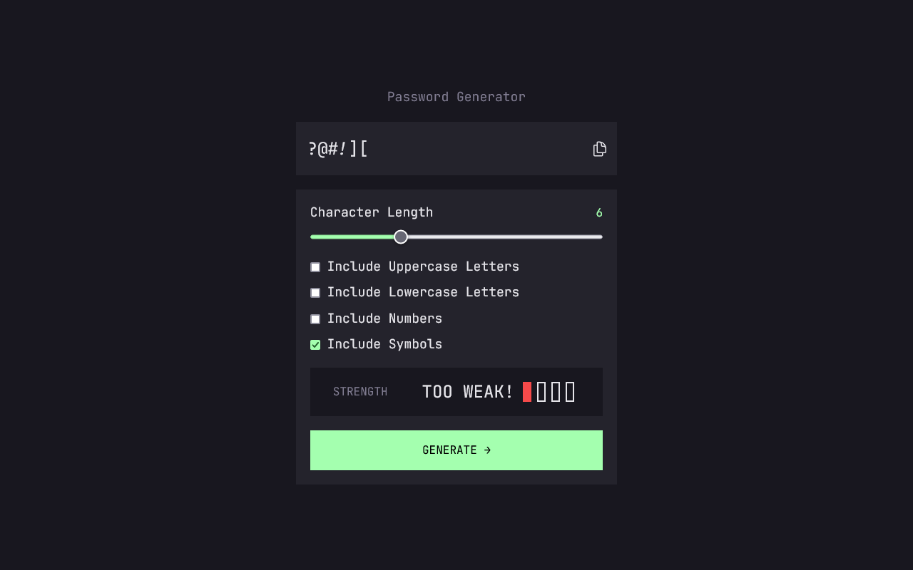
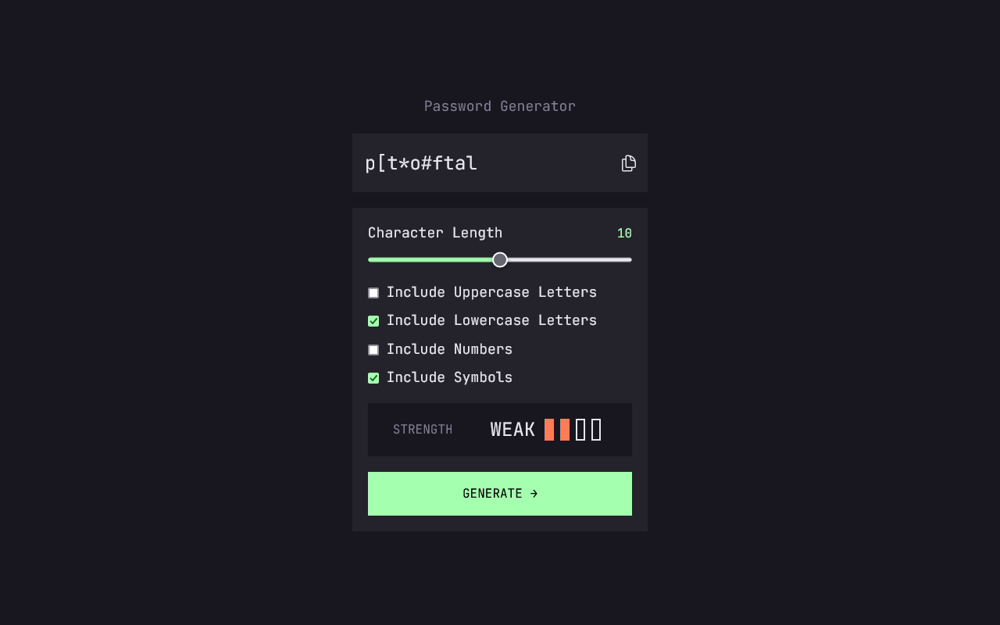
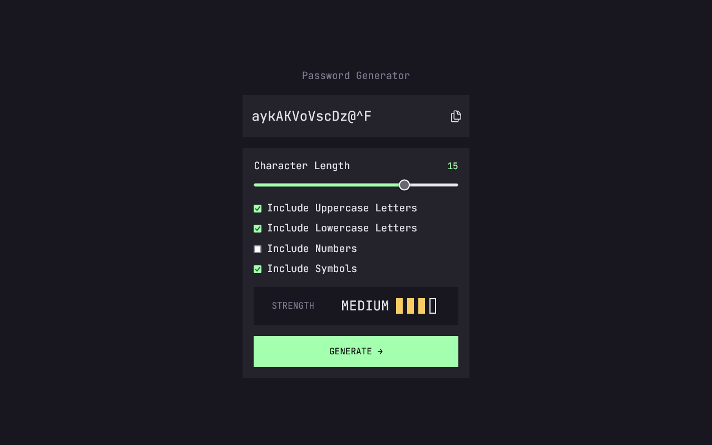
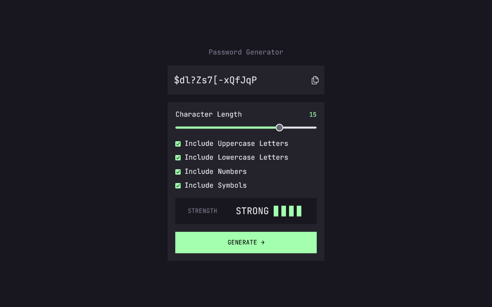

# password-generator-app

Application for generating a random password containing lowercase and uppercase letters, numbers and symbols.

  

    

When the password is generated, the form returns the password strength based on the elements present, as well as the password length.

| When the password is too weak | When the password is weak |
| ----------------------------- | ------------------------- |
|    |   |

| When the password is medium | When the password is strong |
| --------------------------- | --------------------------- |
|   |   |
